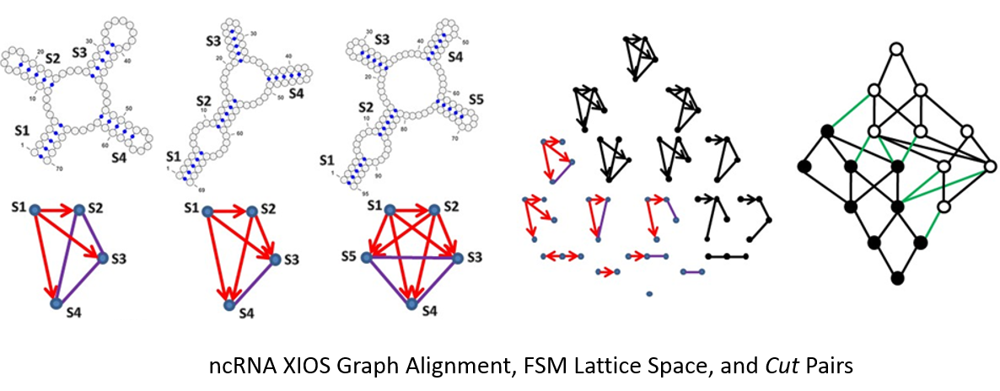
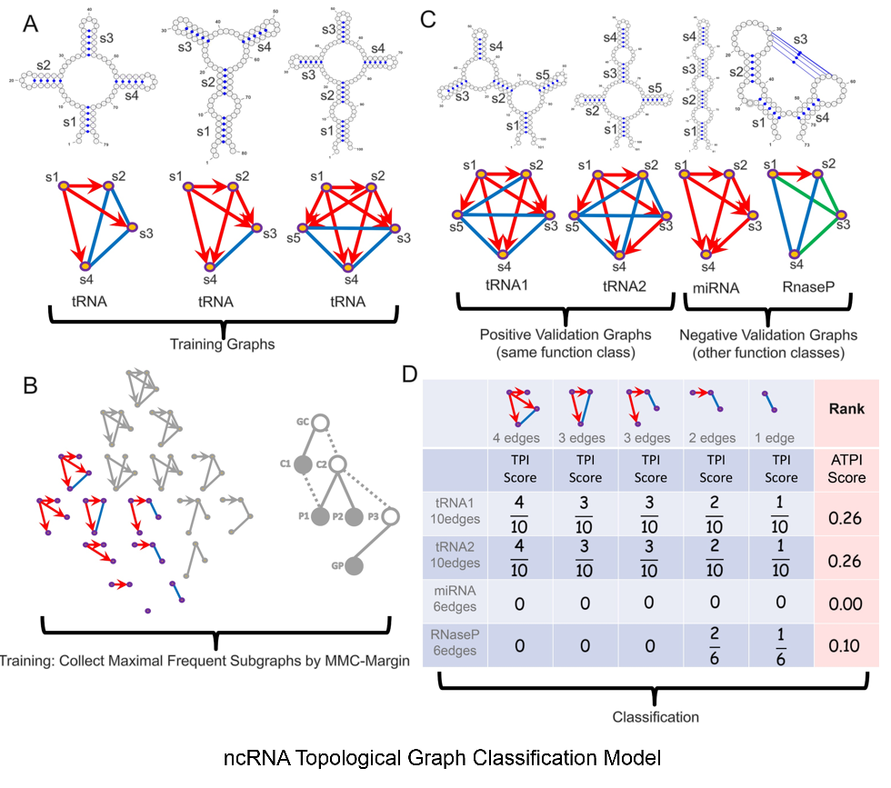
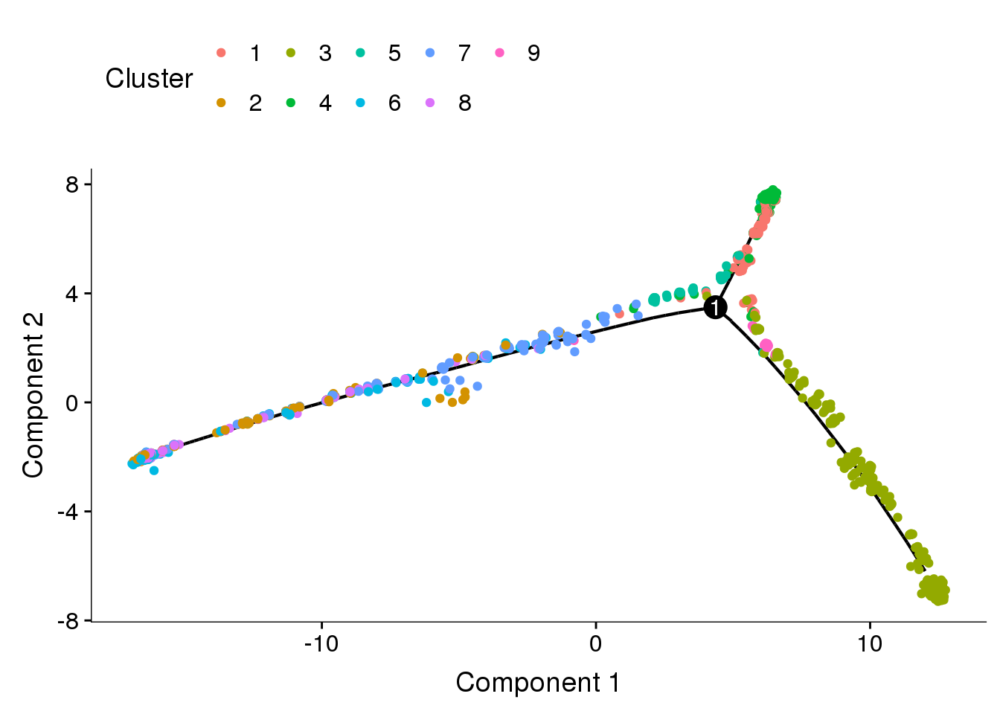

\newline\newline\newline\newline\newline

* [FSM and noncoding-RNA](./e1.pdf)

\newline
Frequent Subgraph Mining Algorithm, NP-Hard, aims to identify the maximum frequent subgraphs shared among given graphs. FSM algorithm might take hundreds of hours to identify ten edges maximum frequent subgraph. My proposed FSM algorithm can identify same frequent subgraph within 300 seconds, in biological, synthetic, and chemical graphs.

\newline

\newline
Next generation sequencing projects identify large number of novel ncRNAs, same scale with annotated genes, little sequence similarity against funcional genome annotation. Due to the RNA evolution flexibility, noncoding RNAs with little sequence simialrity share same function, while their structures are conserved during evolution. I proposed algorithm and pipeline to identify these structural similarity, which indicateds those funcitonal noncoding RNAs share less than 10% sequence similarity, while more than 50% structure similarity.
\newline

\newline

\newline\newline\newline\newline\newline

* [A single cell RNA-Seq analysis](./example2.html)

\newline
Scientists use to analyze bulk RNA-Seq which is a gene expression combination of Ex. B, T, NK, progenitor cells, stem cells, etc. Single cell RNA-Seq is cutting edge RNA-Seq techology to identify gene expression within cells. However, cell type classification is non-trivial. This example shows an unsupervised learning cell type classification and differential expression analysis. Please let me know if you have interest on supervised learning cell type classification.
\newline

\newline

\newline\newline\newline\newline\newline

* [Single Cell Differentiation Tradectory Analysis](./example3.html)

\newline

\newline

\newline

* [Single Cell ATAC TF Motif Analysis](./example4.html)

\newline

\newline

